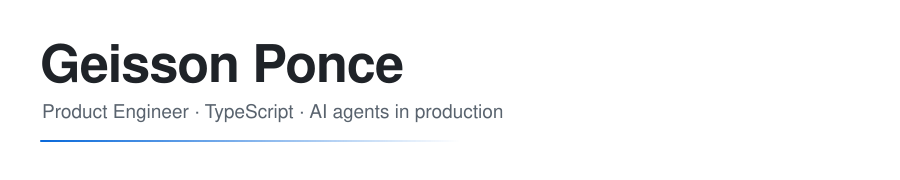

<picture>
  <source media="(prefers-color-scheme: dark)" srcset="assets/header-dark.svg">
  <source media="(prefers-color-scheme: light)" srcset="assets/header-light.svg">
  
</picture>

  <a href="https://github.com/DenverCoder1/readme-typing-svg">
    <picture>
      <source media="(prefers-color-scheme: dark)" srcset="https://readme-typing-svg.demolab.com?font=JetBrains+Mono&weight=500&size=17&duration=3200&pause=900&color=9198A1&center=true&vCenter=true&width=640&height=40&lines=Shipping+AI+agents+that+survive+contact+with+real+users;TypeScript+end+to+end%3A+Next.js%2C+NestJS%2C+Prisma%2C+Temporal;Product+Engineer+at+Primero+AI">
      
    </picture>
  </a>

I build the platform that lets a team design, run and observe AI agents against messy enterprise systems: ERPs, CRMs, spreadsheets and legacy SQL. Most of my day is TypeScript across the whole stack, with durable workflows on Temporal and infrastructure on AWS.

Systems and Computing Engineer. I care about typed boundaries, small modules, and code that is still readable six months later.

### Now

- Building the AI agent platform at [Primero AI](https://primero.com): agent runtime, workflow orchestration, sandboxed execution, observability.
- Connecting agents to hostile data sources such as Sybase ASE, SQL Server and HANA without letting the mess leak into the domain model.
- Sharpening a terminal-first workflow: Neovim, Zellij, Ghostty and Rust CLI tools.

### Stack

  

Also in daily use: Temporal · Mastra · AI SDK · tRPC · Zod · Turborepo · pnpm · Flutter

### Selected work

| Project | What it is |
| --- | --- |
| [dotfiles-terminal-setup](https://github.com/Geisson19/dotfiles-terminal-setup) | Reproducible terminal environment: LazyVim, Ghostty, Zellij and a curated set of Rust CLI tools. |
| [bili](https://github.com/Geisson19/bili-back) | Product built end to end: [NestJS backend](https://github.com/Geisson19/bili-back), [Flutter app](https://github.com/Geisson19/bili-app) and [Astro web](https://github.com/Geisson19/bili-web). |
| [Diametro](https://github.com/Geisson19/Diametro) | Mobile app to protect journalists during field coverage, with its [admin panel](https://github.com/Geisson19/Diametro_admin_front) and [backend](https://github.com/Geisson19/Diametro_backend). |

### Activity

  <picture>
    <source media="(prefers-color-scheme: dark)" srcset="profile/stats-dark.svg">
    <source media="(prefers-color-scheme: light)" srcset="profile/stats-light.svg">
    
  </picture>
  <picture>
    <source media="(prefers-color-scheme: dark)" srcset="profile/langs-dark.svg">
    <source media="(prefers-color-scheme: light)" srcset="profile/langs-light.svg">
    
  </picture>

  <picture>
    <source media="(prefers-color-scheme: dark)" srcset="https://streak-stats.demolab.com?user=Geisson19&theme=github-dark-blue&hide_border=true&background=00000000&ring=58A6FF&fire=58A6FF&currStreakLabel=58A6FF">
    <source media="(prefers-color-scheme: light)" srcset="https://streak-stats.demolab.com?user=Geisson19&theme=default&hide_border=true&background=00000000&ring=0969DA&fire=0969DA&currStreakLabel=0969DA">
    
  </picture>

<picture>
  <source media="(prefers-color-scheme: dark)" srcset="https://raw.githubusercontent.com/Geisson19/Geisson19/output/snake-dark.svg">
  <source media="(prefers-color-scheme: light)" srcset="https://raw.githubusercontent.com/Geisson19/Geisson19/output/snake-light.svg">
  
</picture>

### Reach me

The best place is [LinkedIn](https://www.linkedin.com/in/geissonponce). Email works too: g.ponce1901@gmail.com.
